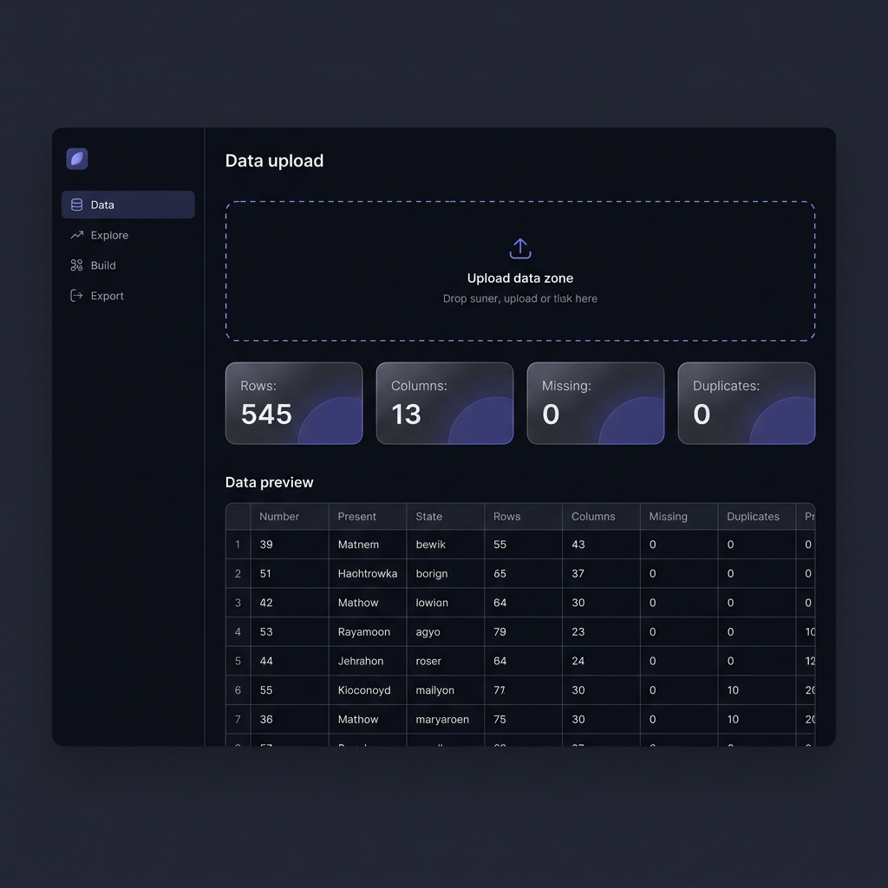
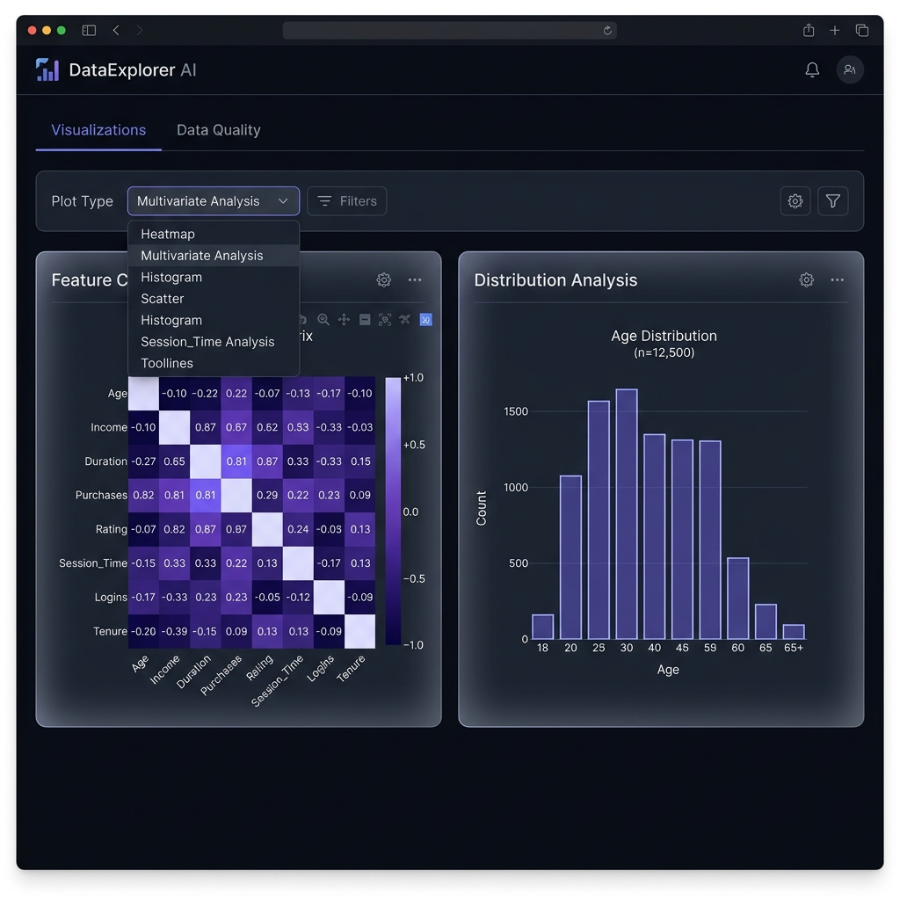
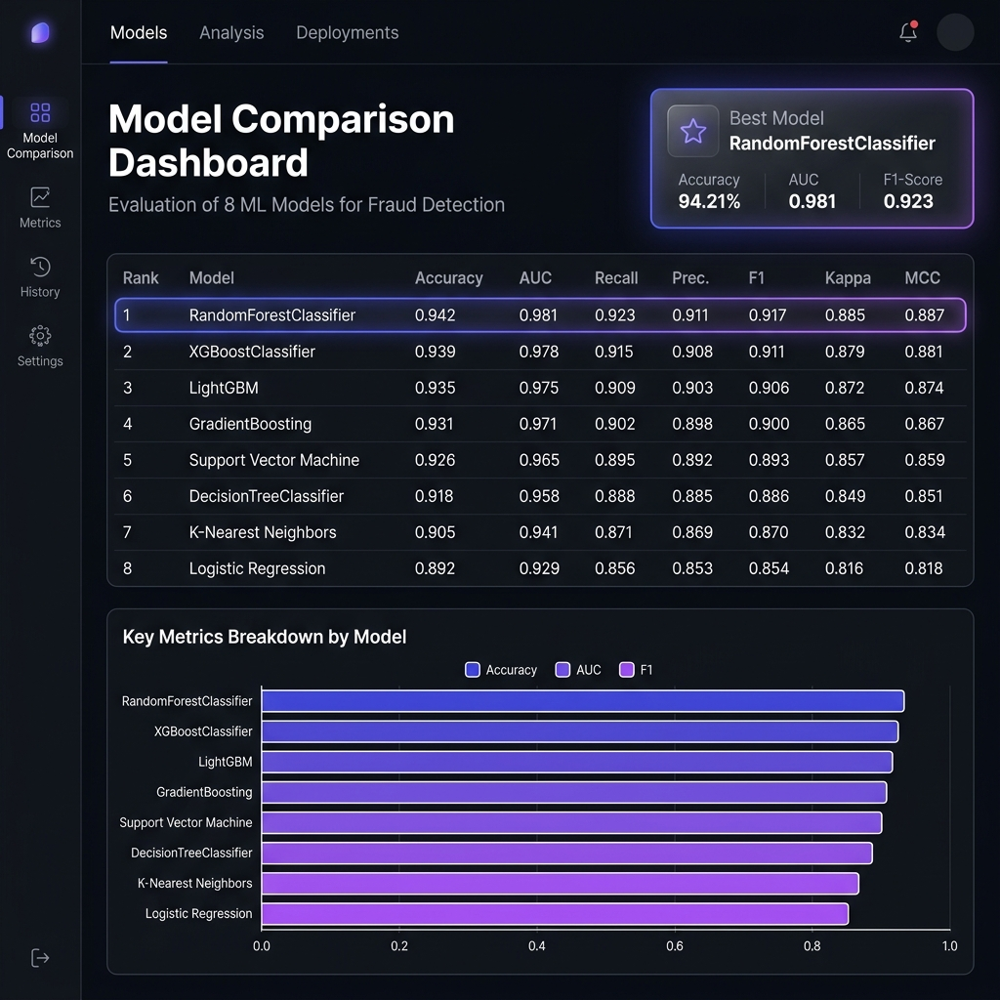
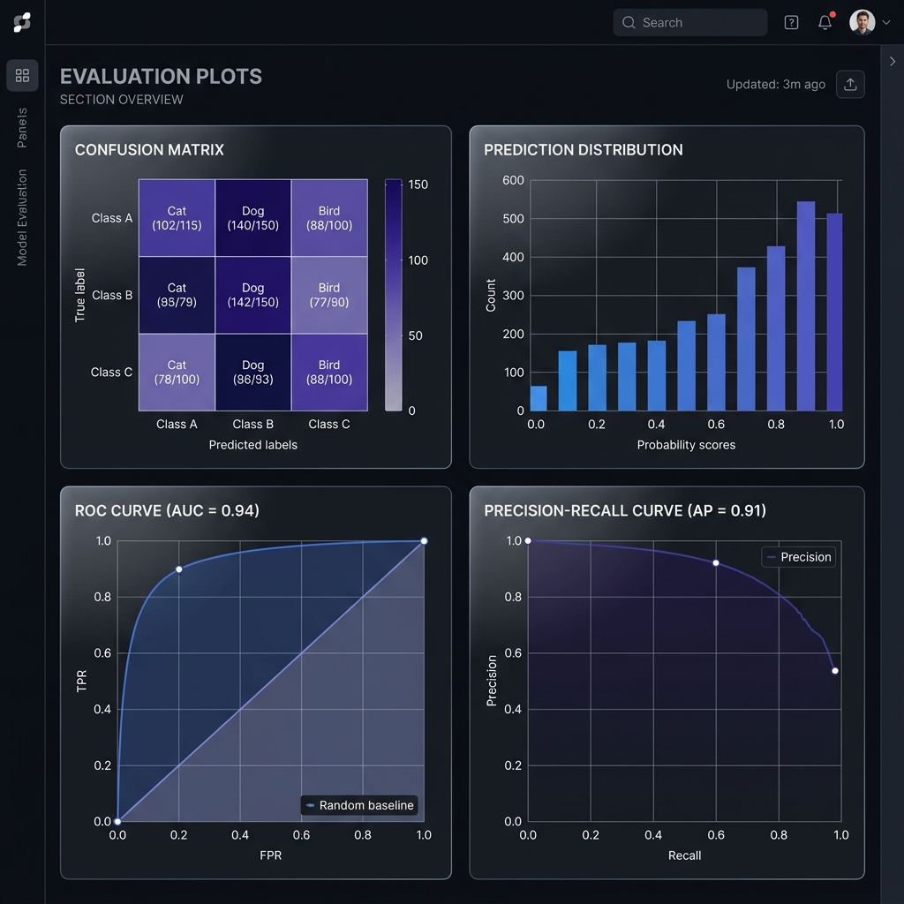
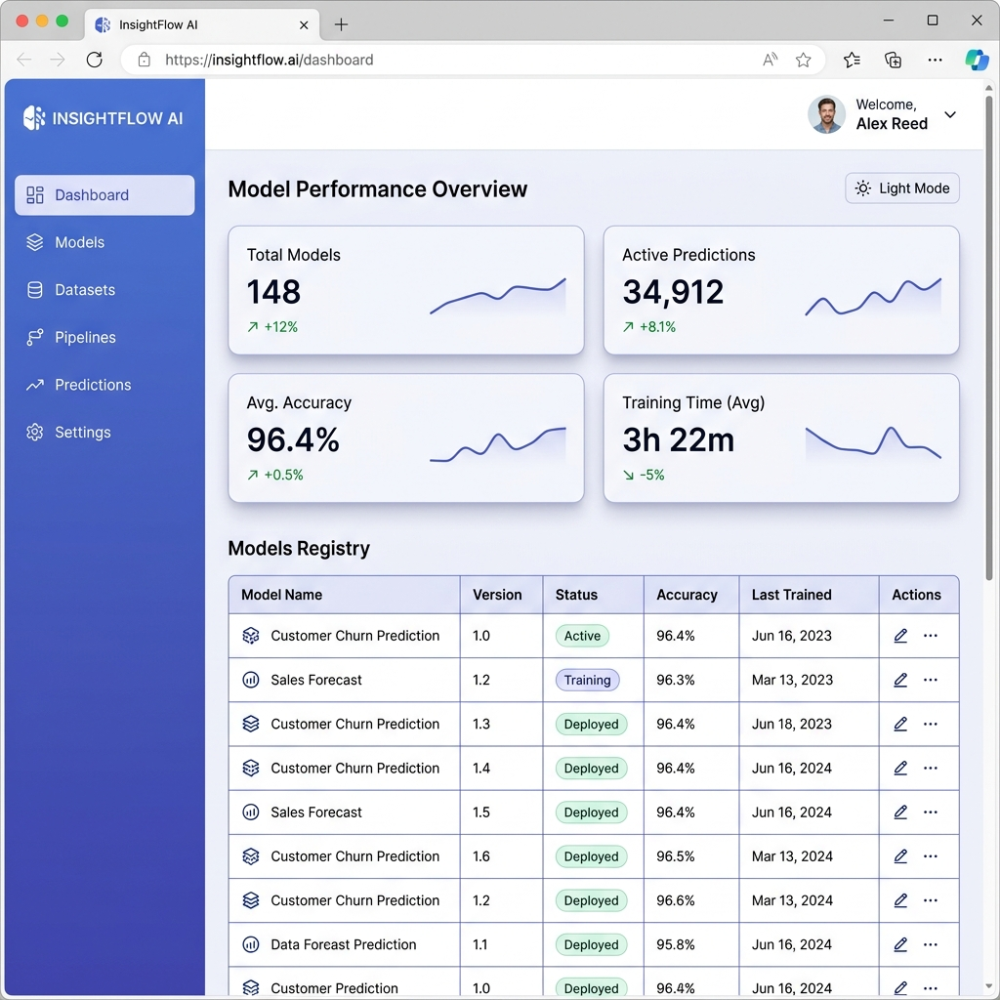

<!-- ═══════════════════════════════════════════════════════════════════ -->

<div align="center">

<br>



<br><br>

# **A L G O L I N E**

**Automated Machine Learning Platform**

<br>

[](https://python.org)
[](https://fastapi.tiangolo.com)
[](https://pycaret.org)
[](https://optuna.org)
[](https://docker.com)

<br>

*Upload a raw dataset. Explore it visually. Train, compare, and tune models automatically.*
*Export production ready pipelines. No code required.*

<br>

[**Live Demo**](https://huggingface.co/spaces/Al1Abdullah/AutoML) ·
[**Report Bug**](https://github.com/Al1Abdullah/Algoline/issues) ·
[**Request Feature**](https://github.com/Al1Abdullah/Algoline/issues)

<br>

</div>

<!-- ═══════════════════════════════════════════════════════════════════ -->

<br>

## About

Algoline is a self contained machine learning platform that handles the complete modeling lifecycle inside your browser. It is not a notebook wrapper or a low code drag and drop builder. It is a production grade system backed by a FastAPI server, PyCaret's model comparison engine, Optuna's Bayesian optimization, and a hand crafted frontend with zero framework dependencies.

You upload data. The platform profiles it, surfaces quality issues, and presents 18 interactive visualizations to help you understand what you are working with before a single model is trained. When you are ready, one click triggers a cross validated comparison of every relevant algorithm. The best performer is highlighted, evaluation diagnostics are generated, and the entire pipeline is available for download as a serialized artifact you can deploy anywhere Python runs.

Every surface in the interface is designed with intention. The dual theme system adapts every chart, card, table, and interactive element between a glassmorphism dark mode and an indigo tinted light mode, without visual compromise in either.

<br>

<!-- ═══════════════════════════════════════════════════════════════════ -->

## The Platform

<br>

### Data Profiling and Quality Analysis

The moment a file lands in the upload zone, Algoline parses it, computes row and column counts, scans for missing values and duplicates, infers column types, and generates a full statistical summary. Contextual insights are surfaced automatically, flagging potential data quality issues before you even think to look for them. The data preview supports tabbed views for raw values, column types, and descriptive statistics.


<br><br>

### Exploratory Visualization Engine

Eighteen interactive chart types organized across five analytical categories, each rendered with Plotly and fully responsive to theme changes.

**Distribution Analysis** covers histograms, kernel density estimation, box plots, and violin plots for understanding feature spreads. **Missing Data** provides bar charts and heatmaps for identifying gaps and missingness patterns. **Correlation and Relationships** includes correlation heatmaps, pair plots, scatter plots, and joint distribution plots. **Target Analysis** offers count plots, pie charts, class distribution breakdowns, target histograms, and mean target per category views. **Advanced** visualizations handle scatter vs index plots for detecting data ordering effects, grouped box plots for multivariate comparisons, and faceted small multiples.



<br><br>

### Automated Model Training and Leaderboard

Configure preprocessing options independently (duplicate removal, outlier detection, normalization, multicollinearity filtering, skewness transformation, feature selection, polynomial features, class imbalance correction), set your test split and cross validation folds, and trigger training. PyCaret compares every relevant algorithm, from Logistic Regression and Random Forest through XGBoost, LightGBM, and CatBoost, ranking them on a cross validated leaderboard. The best model is highlighted with a glowing card, and a comparison bar chart lets you visually contrast performance across any metric.



<br><br>

### Evaluation Diagnostics

Every trained model generates a complete set of evaluation plots: confusion matrices, prediction distribution charts, and performance curves. These are rendered in a responsive grid, each inside its own card with labeled titles. After hyperparameter tuning, the plots regenerate to reflect the optimized model's performance, so you always see the most current evaluation state.



<br><br>

### Dual Theme System

A single toggle switches the entire interface between dark and light modes. The dark theme uses glassmorphism surfaces with translucent cards, ambient indigo gradients, and subtle glow animations. The light theme uses an indigo tinted color palette with layered card shadows, visible table gridlines, and a gradient sidebar. Every Plotly chart re renders its grid colors, text, and backgrounds to match the active theme. Nothing bleeds between modes.



<br>

<!-- ═══════════════════════════════════════════════════════════════════ -->

## Architecture

```
algoline/
├── main.py                 FastAPI backend with 30+ endpoints
├── static/
│   └── index.html          Single page frontend application
├── docs/
│   └── images/             Documentation assets
├── requirements.txt        Python dependencies
├── Dockerfile              Production container
└── README.md
```

<br>

| Layer | Technology |
|:--|:--|
| **Server** | FastAPI, Uvicorn |
| **Runtime** | Python 3.10 |
| **ML Engine** | PyCaret 3.3 (wraps scikit-learn, XGBoost, LightGBM, CatBoost) |
| **Optimization** | Optuna 3.5+ with Bayesian TPE sampler |
| **Visualization** | Plotly 5.24, server side figure generation, client side rendering |
| **Frontend** | Vanilla HTML, CSS custom properties, JavaScript. Zero frameworks. |
| **Deployment** | Docker, Hugging Face Spaces |

<br>

<!-- ═══════════════════════════════════════════════════════════════════ -->

## Supported Algorithms

<table>
<tr>
<td width="50%" valign="top">

**Classification**

Logistic Regression, K Nearest Neighbors, Naive Bayes, Decision Tree, Random Forest, Extra Trees, Gradient Boosting, AdaBoost, XGBoost, LightGBM, CatBoost, SVM (Linear and RBF), Ridge Classifier, LDA, QDA

</td>
<td width="50%" valign="top">

**Regression**

Linear Regression, Lasso, Ridge, Elastic Net, Decision Tree, Random Forest, Extra Trees, Gradient Boosting, AdaBoost, XGBoost, LightGBM, CatBoost, SVR, KNN Regressor, Huber Regressor, Passive Aggressive Regressor

</td>
</tr>
</table>

The platform automatically determines which algorithms to run based on your task type and applies a time budget to keep training within reasonable bounds on any infrastructure.

<br>

<!-- ═══════════════════════════════════════════════════════════════════ -->

## Quick Start

**Run Locally**

```bash
git clone https://github.com/Al1Abdullah/Algoline.git
cd Algoline
pip install -r requirements.txt
python main.py
```

Open `http://localhost:7860` in your browser.

<br>

**Run with Docker**

```bash
docker build -t algoline .
docker run -p 7860:7860 algoline
```

<br>

<!-- ═══════════════════════════════════════════════════════════════════ -->

## API Reference

<details>
<summary><strong>Data Endpoints</strong></summary>

<br>

| Method | Route | Description |
|:--|:--|:--|
| `POST` | `/api/upload` | Upload dataset (CSV, TSV, XLSX) with automatic profiling |
| `POST` | `/api/target` | Set target column and auto detect task type |

</details>

<details>
<summary><strong>Exploration Endpoints</strong></summary>

<br>

| Method | Route | Description |
|:--|:--|:--|
| `POST` | `/api/explore/distribution` | Histogram |
| `POST` | `/api/explore/kde` | Kernel density estimation |
| `POST` | `/api/explore/boxplot` | Box plot |
| `POST` | `/api/explore/violin` | Violin plot |
| `POST` | `/api/explore/missing` | Missing value bar chart |
| `POST` | `/api/explore/missing_heatmap` | Missing value heatmap |
| `POST` | `/api/explore/correlation` | Correlation heatmap |
| `POST` | `/api/explore/pairplot` | Pair plot matrix |
| `POST` | `/api/explore/scatter_xy` | Scatter plot |
| `POST` | `/api/explore/jointplot` | Joint distribution |
| `POST` | `/api/explore/countplot` | Count plot |
| `POST` | `/api/explore/pie` | Pie chart |
| `POST` | `/api/explore/target` | Target distribution |
| `POST` | `/api/explore/counts` | Class distribution |
| `POST` | `/api/explore/mean_target` | Mean target per category |
| `POST` | `/api/explore/scatter_index` | Scatter vs index |
| `POST` | `/api/explore/grouped_box` | Grouped box plot |
| `POST` | `/api/explore/facetgrid` | Faceted small multiples |
| `POST` | `/api/explore/quality` | Feature quality statistics |

</details>

<details>
<summary><strong>Training and Tuning</strong></summary>

<br>

| Method | Route | Description |
|:--|:--|:--|
| `POST` | `/api/train` | Compare all models, return leaderboard and evaluation plots |
| `POST` | `/api/compare` | Re render comparison chart for a selected metric |
| `POST` | `/api/tune` | Hyperparameter optimization via Optuna, random, or grid search |

</details>

<details>
<summary><strong>Export</strong></summary>

<br>

| Method | Route | Description |
|:--|:--|:--|
| `GET` | `/api/export/pipeline` | Download finalized model (.pkl) |
| `GET` | `/api/export/leaderboard` | Download model comparison (.csv) |
| `GET` | `/api/export/predictions` | Download holdout predictions (.csv) |
| `GET` | `/api/summary` | Pipeline metadata |

</details>

<br>

<!-- ═══════════════════════════════════════════════════════════════════ -->

## License

This project is open source and available under the [MIT License](LICENSE).
